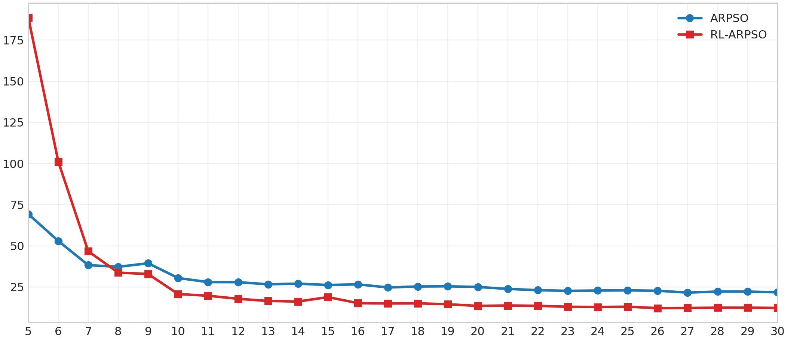
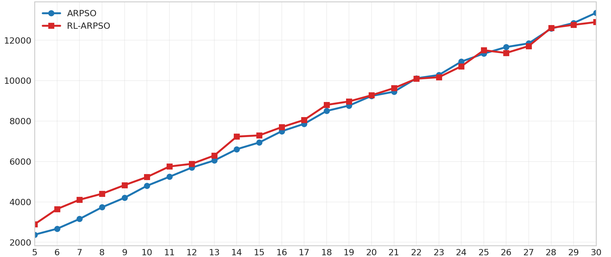
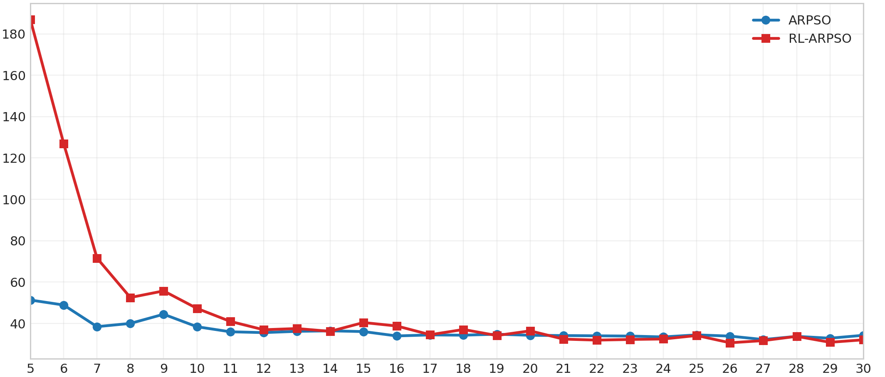

## ARPSO Results

The results for ARPSO can be found in the following figures:

### Average Number of Iterations vs Swarm Size

### Average Swarm Distance vs Swarm Size

### Average Source-Seeking Time vs Swarm Size

## Source Speed Analysis

The table below reports the average convergence time (lower is better) for different PSO variants under varying source speeds.

| Method   |      0.00 |      0.05 |      0.10 |      0.15 |      0.20 |      0.25 |      0.30 |
| -------- | --------: | --------: | --------: | --------: | --------: | --------: | --------: |
| APSO     |     16.05 |     15.03 | **14.16** |     14.81 |     16.24 | **14.05** | **14.14** |
| RL-APSO  | **14.86** | **14.90** |     14.24 | **14.74** | **14.89** |     14.32 |     14.80 |
| ARPSO    |     31.14 |     35.06 |     38.75 |     30.72 |     34.65 |     30.87 |     32.35 |
| RL-ARPSO |     32.00 |     32.29 |     32.24 |     31.42 |     34.42 |     32.20 |     32.30 |
| SPSO     |     43.68 |     35.14 |     39.96 |     39.50 |     37.39 |     43.92 |     32.52 |
| RL-SPSO  |     42.35 |     33.23 |     42.38 |     40.73 |     35.57 |     40.80 |     39.59 |

**Table:** Average convergence time under varying source speeds. Lower values indicate faster convergence.
